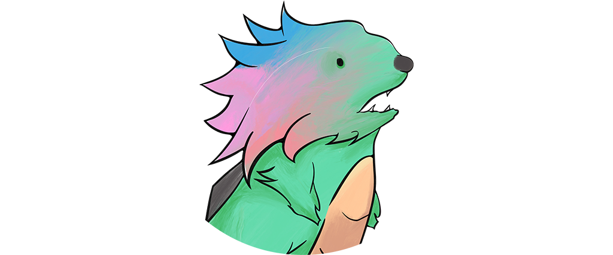

# Quetza │ [](https://github.com/unknowableshade/quetza/actions/workflows/ci.yml)

Awesome Discord bot that performs various duties on my server.

## Quick Start

- [Documentation](<https://docs.ermnvldmr.com/en/quetza/>)
- [Docker Image](<https://ghcr.io/deytenit/quetza>)
- [Report an issue](<https://github.com/deyteit/Quetza/issues>)

## Who Are You?

### Visitor

Just interested in what Quetza can do.

- **See Quetza in Action by running an image**: [ghcr.io: quetza image](https://ghcr.io/deytenit/quetza)

### Developer

Want to run or contribute to the bot.

- **Documentation**: [Docs: Quetza](https://docs.ermnvldmr.com/en/quetza/)
- **Run with Docker** (recommended):
  ```bash
  docker run \
    -e DISCORD_TOKEN=<your-token> \
    --name quetza -d \
    ghcr.io/deyteit/quetza:latest
  ```
- **Build from Source**:
  ```bash
  pnpm install
  pnpm run build
  pnpm start
  ```
- **Environment Variables**:
  - `DISCORD_TOKEN`: Generated at [Discord Developer Portal](https://discord.com/developers/applications)

### Designer

Interested in the visual design and messaging.

- **Icons & Branding**: See [assets/](./assets/) directory for logos and visual elements
- **Message Typography**: Explore Discord embeds and message formatting in the `lib/replies.ts` files of the respectful modules.
- **Design License**: Branding assets are separately licensed (see [LICENSE](./assets/LICENSE))

### Contributor

Want to submit improvements?

Just create a Pull-Request, and I would be greatful. (or just fork repo for yourself, then I won't even be needed)

## Communication & Support

- **Issues**: [Github: issues](https://github.com/deyteit/Quetza/issues)

> Not a fact that I would care about that

## License

**Quetza's** source code is licensed under **[the MIT Licence](./LICENSE)**.

**Notice!** This does not cover '**_Quetza_**' branding such as **[logo](./assets/quetza-logo.png)** or other **[assets listed](./assets/)**, as these are protected by **[the separate licence](./assets/LICENSE)**.
