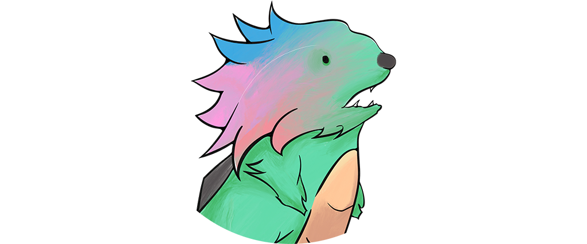

# Quetza │ [](https://github.com/unknowableshade/quetza/actions/workflows/ci.yml)

Awesome Discord bot that performs various duties on my server.

## Architecture

At its core **Quetza** is simply a **[database](./prisma/schema.prisma)**-connected **[user-client](./src/lib/client.ts)** with a **[logger](./src/lib/logger.ts)**.

### Modules

**Modules** define the features of **Quetza**.

> 🗂 **The structure** of a **module**

```sh
modules/example/
├ module.ts
├ commands/
│ ├ [command-name].ts
├ events/
│ ├ [event-name].ts
├ lib/
│ ├ [...libraries] // Including controller if exists.
```

#### **module.ts**

**The module** must have a definition file that **adheres** to the following **interface** as _export_.

> 📐 **Module** export **interface** [defined in _[src/lib/types.ts](./src/lib/types.ts)_]

```ts
interface Module {
  name: string; // Name of the module.
  description?: string; // Description of the module.
  controller?: unknown; // The service orchestrating the module. (use it in commands or events)
}
```

#### commands/[command-name].ts

Each **command** has to be defined in its own file, preferably named after **the command** itself.
**The client** indexes **the commands** of each **module** and sends them to **the Discord API**.

> 📐 **Command** **interface** to export [defined in _[src/lib/types.ts](./src/lib/types.ts)_]

```ts
interface Command {
  data: ApplicationCommandData; // Definition of command specifically for the Discord API.
  execute: (client: Client, interaction: CommandInteraction) => Promise<void>;
  // Function that will be called upon interaction invocation.
}
```

> ⚠️ Each **command** must comply with the _command interaction_ requirements of **the Discord API**.

#### events/[event-name].ts

**Events** are pre-defined by **the Discord API** and can only have new functions
bound to **them** by **modules**, despite being declared similarly to **commands**.

> 📐 **Event** **interface** to export [defined in _[src/lib/types.ts](./src/lib/types.ts)_]

```ts
export interface Event {
  name: string;
  execute: (client: Client, eventee: unknown[]) => Promise<void>;
}
```

> ✅ **These** can be re-defined so that they can operate independently in their own **module**.

#### lib/[...libraries] & controller

If you expand the provided **module** **structure**, it will still be a valid **module**.
**_lib/_** is simply a suggestion to add consistency to the codebase.

**The controller** is responsible for orchestrating the behaviour of your **module**.
_Imagine it like a web application service._

> 📘 **For example**, creating players for listening to music on voice channels

## Build System

**Quetza** relies on various dependencies to function correctly. The **[package.json](./package.json)** file lists the _engines_, _toolchain_, _dependencies_, and other _metadata_.

> ⚠️ **pnpm** is being used as package manager.

### External Dependencies

**Modules** (or maybe **Quetza** itself) can leverage external _binaries_
that shall be located at _bin/_ directory or be accessible from _the environment_.

> 🔗 **Listing** of extenal _dependencies_

| **Base/Module** | **Dependency**                             |
| --------------- | ------------------------------------------ |
| Base            | [postgres](https://www.postgresql.org/)    |
| Music           | [yt-dlp](https://github.com/yt-dlp/yt-dlp) |

### Shipping

#### Docker

[](https://github.com/unknowableshade/quetza/actions/workflows/ci.yml)

The primary method of deploying **Quetza** is through
a **[Docker Image](https://hub.docker.com/repository/docker/unknowableshade/quetza)**
provided by the respective
**[action](./.github/workflows/ci.yml)**.

```bash
docker run \
-e DATABASE_URL=*as required by prisma - postgres connection url* \
-e DISCORD_TOKEN=*aquired via Discord Developer Portal* \
--name quetza -d \
unknowableshade/quetza-bot:latest
```

#### From Source

Although it is possible to run it directly from the source, some additional steps are required.

- Push _SQL migrations_ using _prisma_ CLI (that will also generate _client_)

```bash
pnpx prisma migrate deploy
```

- Compile _TypeScript_

```bash
pnpm run build
```

- Run **Quetza**

```bash
pnpm start
```

#### Environment

In any case, you have to provide **environmental variables** for **bot** to run.

- **DISCORD_TOKEN**: generated token issued by **Discord** itself at
  **[Developer Portal](https://discord.com/developers/applications)**.

- **DATABASE_URL**: _postgres_ connection URL,
  if _prisma_ database provider has not been changed.

## Licence

**Quetza's** source code is licensed under **[the MIT Licence](,/LICENSE)**.

**Notice!** This does not cover '**_Quetza_**' branding such as **[logo](./assets/quetza-logo.png)** or other **[assets listed](./assets/)**, as these are protected by **the copyright law**.
