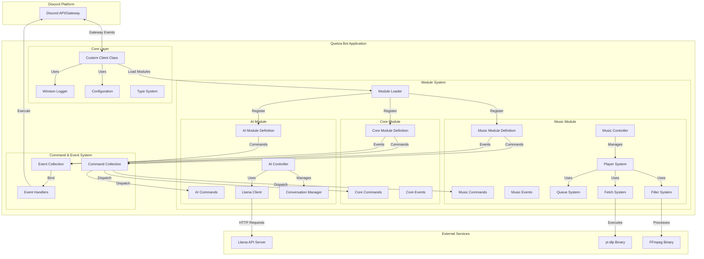
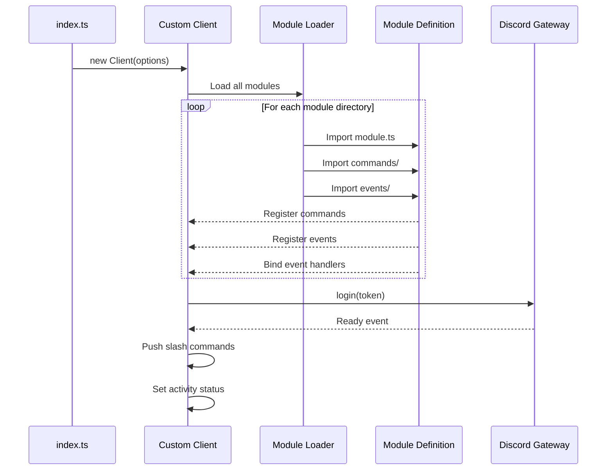
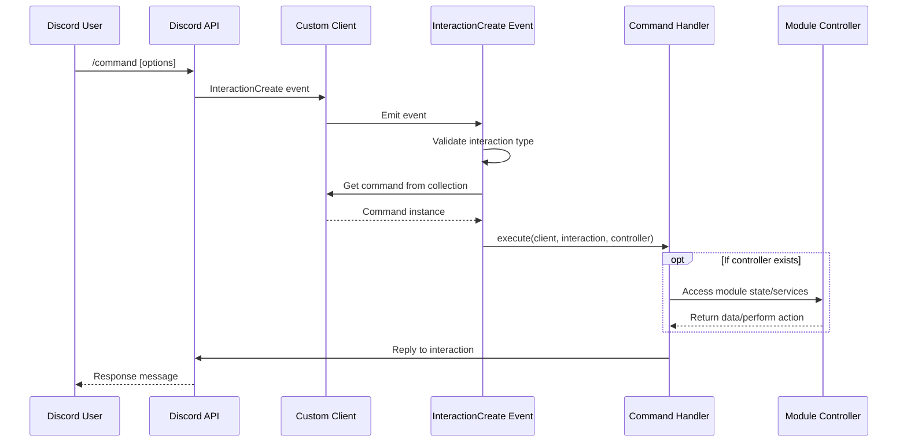
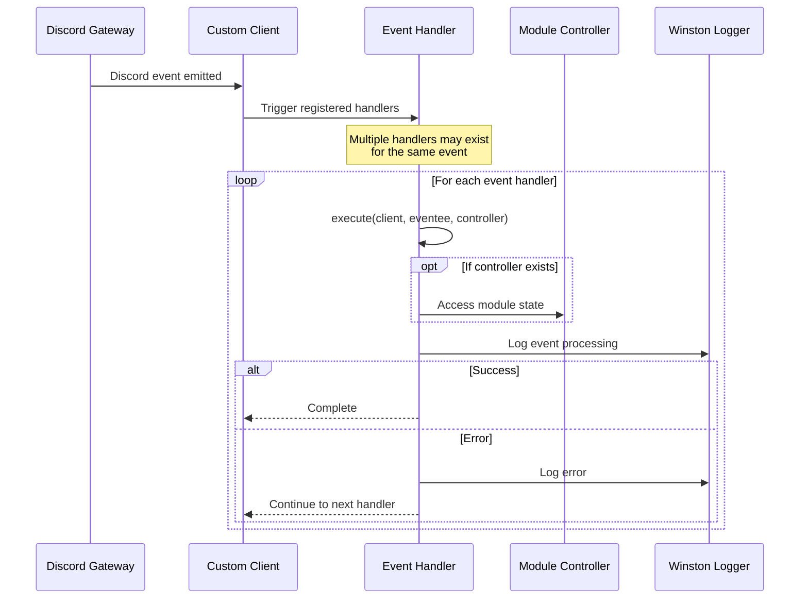

# 3.1 Core Architecture Overview

This document provides a high-level overview of Quetza's architecture, explaining how components interact and data flows through the system.

## 3.1.1 Architecture Diagram



## 3.1.2 Component Relationships

Quetza's architecture is built on several key relationships:

### Client as Central Hub

The **Custom Client** extends Discord.js's `Client` class and acts as the central hub for the entire application:

```typescript
export default class Client<T extends boolean = boolean> extends DiscordClient<T> {
    public readonly commands = new Collection<string, Command>();
    public readonly events = new Collection<string, Event>();
    public readonly modules = new Collection<string, Module>();
}
```

- **Manages three primary collections**: Commands, Events, and Modules
- **Orchestrates module loading** during initialization
- **Provides application status** generation for monitoring
- **Extends Discord.js functionality** with module-aware capabilities

### Module Architecture

Each module is self-contained and follows a consistent structure:

```
module/
├── module.ts          # Module definition and controller export
├── commands/          # Slash command implementations
├── events/            # Discord event handlers
└── lib/              # Module-specific libraries and utilities
```

**Module Definition Interface:**

```typescript
export interface ModuleBase {
    name: string;
    description: string;
    controller?: unknown;
}
```

### Command and Event System

Commands and Events are registered through modules and managed centrally:

- **Commands** are mapped by name in `client.commands` collection
- **Events** are mapped by Discord event name in `client.events` collection
- Each command/event maintains a reference to its parent module
- Events are automatically bound to the Discord.js client during module loading

### Controller Pattern

Modules can optionally export a **controller** for managing complex state:

```typescript
// Music Module Controller Example
export default class Music {
    private players_ = new Collection<string, Player>();
    
    public get(guild: Guild, channel?: GuildTextBasedChannel): Player | undefined
    public set(guild: Guild, channel: GuildTextBasedChannel): Player
    public delete(guildId: string): void
}
```

Controllers provide:
- State management (e.g., guild-to-player mappings)
- Service orchestration (e.g., player lifecycle management)
- Shared logic accessible to all module commands/events

## 3.1.3 Data Flow

### Application Startup Flow



### Command Execution Flow



### Event Processing Flow



## 3.1.4 Design Patterns

Quetza employs several design patterns to maintain clean, maintainable architecture:

### 1. **Module Pattern**

Each module is a self-contained unit with its own:
- Commands
- Events
- Controller (optional)
- Type definitions
- Utility functions

This promotes:
- **Separation of concerns**
- **Independent development** of features
- **Easy testing** of isolated components
- **Clear boundaries** between functionality

### 2. **Registry Pattern**

The Client class maintains registries (Collections) for:
- `commands`: Maps command names to Command instances
- `events`: Maps event names to Event instances
- `modules`: Maps module names to Module instances

Benefits:
- **Fast lookups** by name
- **Centralized management** of application components
- **Type-safe access** to registered items

### 3. **Dependency Injection**

Controllers are injected into command/event execute functions:

```typescript
async function execute(
    client: Client,
    interaction: CommandInteraction,
    controller?: unknown  // Injected by the framework
): Promise<void> {
    const music = controller as Music;
    const player = music.get(interaction.guild);
    // ...
}
```

This enables:
- **Loose coupling** between commands and controllers
- **Easy testing** with mock controllers
- **Flexible architecture** for different module types

### 4. **Builder Pattern**

Slash commands use Discord.js's builder pattern:

```typescript
const data = new SlashCommandBuilder()
    .setName("ping")
    .setDescription("Try to ping me.");
```

Provides:
- **Fluent API** for command construction
- **Type safety** at compile time
- **Clear, readable** command definitions

### 5. **Strategy Pattern**

The module system allows different strategies for handling:
- **Command execution** (different commands have different logic)
- **Event handling** (different events trigger different responses)
- **State management** (controllers implement different strategies)

### 6. **Singleton Pattern**

Core services are singletons:
- **Logger**: Single Winston logger instance shared across the application
- **Config**: Single configuration object
- **Client**: Single Discord client instance

This ensures:
- **Consistent state** across the application
- **Efficient resource usage**
- **Global accessibility** to core services

### 7. **Factory Pattern**

The module loader acts as a factory:
- Creates command instances from command files
- Creates event instances from event files
- Creates module instances from module definitions

Benefits:
- **Consistent instantiation** logic
- **Centralized creation** of components
- **Automatic registration** with the client

## Key Architectural Principles

1. **Modularity**: Features are isolated in modules with clear interfaces
2. **Type Safety**: TypeScript provides compile-time guarantees
3. **Extensibility**: New modules can be added without modifying core
4. **Separation of Concerns**: Clear boundaries between layers
5. **Convention over Configuration**: Standardized directory structure and naming
6. **Fail-Safe**: Comprehensive error handling and logging
7. **Stateless Commands**: Commands don't maintain state; controllers do

## Related Documentation

- [Client System](./02-client-system.md) - Detailed client implementation
- [Module System](./03-module-system.md) - Module architecture and loading
- [Command System](./04-command-system.md) - Command registration and execution
- [Event System](./05-event-system.md) - Event handling mechanisms
- [Type System](./08-type-system.md) - TypeScript type definitions
