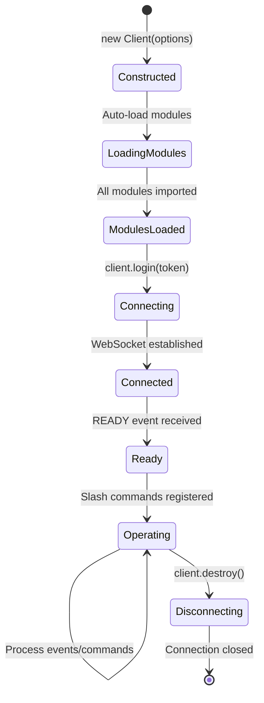

# 3.2 Client System

The Client System is the heart of Quetza, extending Discord.js's `Client` class with module management capabilities and serving as the central orchestrator for the entire application.

## 3.2.1 Custom Client Class

Quetza's `Client` class extends Discord.js's base `Client` to add module-aware functionality:

```typescript
// src/lib/client.ts
export default class Client<T extends boolean = boolean> extends DiscordClient<T> {
    /**
     * Mapping command name to its instance.
     */
    public readonly commands = new Collection<string, Command>();

    /**
     * Mapping event name to its instance.
     */
    public readonly events = new Collection<string, Event>();

    /**
     * Mapping module name to its instance.
     */
    public readonly modules = new Collection<string, Module>();

    public constructor(options: ClientOptions) {
        super(options);

        readdirSync(config.path.modules).forEach((module) =>
            this.importModule(
                toModuleDeclaration(module),
                toModuleCommands(module),
                toModuleEvents(module)
            )
        );
    }
}
```

### Key Features

1. **Type-Safe Generic**: `Client<T extends boolean>` indicates ready state
2. **Three Collections**: Commands, Events, and Modules for registry pattern
3. **Automatic Module Loading**: Modules are loaded during construction
4. **Discord.js Integration**: Full access to Discord.js functionality

### Type Parameter

The generic `T` parameter indicates client ready state:

```typescript
// Before ready event
Client<false>

// After ready event
Client<true>

// Either state (default)
Client<boolean>
```

This provides **compile-time safety** for operations that require a ready client.

## 3.2.2 Discord.js Integration

Quetza seamlessly integrates with Discord.js v14:

```typescript
// Inherits all Discord.js Client functionality
class Client<T> extends DiscordClient<T> {
    // ... Quetza additions
}
```

### Available Discord.js Properties

All standard Discord.js properties are accessible:

```typescript
client.user          // ClientUser representing the bot
client.guilds        // GuildManager for guild operations
client.channels      // ChannelManager for channel operations
client.application   // Application for slash command registration
client.ws            // WebSocketManager for ping and shard info
```

### Discord.js Methods

All Discord.js methods remain available:

```typescript
client.login(token)              // Connect to Discord
client.destroy()                 // Disconnect from Discord
client.isReady()                 // Type guard for ready state
client.on(event, listener)       // Event listener registration
```

### Example Usage

```typescript
const client = new Client({
    intents: [
        GatewayIntentBits.Guilds,
        GatewayIntentBits.GuildVoiceStates,
        GatewayIntentBits.GuildMembers
    ]
});

// Discord.js functionality
client.on('ready', () => {
    console.log(`Logged in as ${client.user.tag}`);
});

// Quetza additions
console.log(`Loaded ${client.modules.size} modules`);
console.log(`Loaded ${client.commands.size} commands`);
```

## 3.2.3 Client Initialization

The client initialization process involves several stages:

### Stage 1: Constructor Execution

```typescript
const client = new Client(options);
```

During construction:
1. Calls `super(options)` to initialize Discord.js Client
2. Reads the modules directory (`config.path.modules`)
3. For each module folder, calls `importModule()` with:
   - Path to `module.js` (module definition)
   - Path to `commands/` directory
   - Path to `events/` directory

### Stage 2: Module Import

```typescript
private async importModule(
    declaration: string,
    commands: string,
    events: string
): Promise<void> {
    const module = await import(declaration).then((module: ModuleBase) =>
        this.modules.ensure(module.name, () => ({ 
            ...module, 
            commands: [], 
            events: [] 
        }))
    );

    importDir<CommandBase>(commands, (command) => {
        const saved = this.commands.ensure(command.data.name, () => ({ 
            ...command, 
            module 
        }));
        module.commands.push(saved);
    });

    importDir<EventBase>(events, (event) => {
        const saved = this.events.ensure(event.name, () => ({ 
            ...event, 
            module 
        }));
        module.events.push(saved);
        this.on(event.name, (...eventee: unknown[]) =>
            saved.execute(this, eventee, module.controller)
        );
    });
}
```

**Import Process:**

1. **Import module definition**: Load `module.ts` containing name, description, and optional controller
2. **Register module**: Add to `client.modules` collection
3. **Import commands**: Load all `.js` files from `commands/` directory
4. **Register commands**: Add to `client.commands` and module's command list
5. **Import events**: Load all `.js` files from `events/` directory
6. **Register events**: Add to `client.events` and module's event list
7. **Bind event handlers**: Attach event handlers to Discord.js client

### Stage 3: Login and Ready

```typescript
// src/index.ts
client.login(config.application.token);
```

After login:
1. Discord.js establishes WebSocket connection
2. Gateway sends `READY` event
3. Core module's ready event handler executes:
   - Registers slash commands with Discord
   - Sets bot activity status
   - Logs application status

## 3.2.4 Gateway Intents

Intents specify which events Discord should send to the bot:

```typescript
// src/index.ts
const client = new Client({
    intents: [
        GatewayIntentBits.Guilds,
        GatewayIntentBits.GuildVoiceStates,
        GatewayIntentBits.GuildMembers
    ]
});
```

### Required Intents

| Intent | Purpose | Required For |
|--------|---------|--------------|
| `Guilds` | Basic guild information | All functionality |
| `GuildVoiceStates` | Voice channel state changes | Music module |
| `GuildMembers` | Member join/leave events | User tracking (future) |

### Privileged Intents

`GuildMembers` is a **privileged intent** requiring:
1. Enable in Discord Developer Portal
2. Verification for bots in 100+ servers
3. Careful consideration of privacy implications

## 3.2.5 Client Collections

The client maintains three primary collections:

### Commands Collection

```typescript
public readonly commands = new Collection<string, Command>();
```

**Structure:**
- **Key**: Command name (e.g., `"ping"`, `"play"`)
- **Value**: Command object with `data`, `execute`, and `module`

**Usage:**
```typescript
// Retrieve command
const command = client.commands.get('ping');

// Iterate commands
client.commands.forEach((command, name) => {
    console.log(`${name}: ${command.data.description}`);
});

// Get all command data for registration
const commandData = client.commands.map(cmd => cmd.data);
```

### Events Collection

```typescript
public readonly events = new Collection<string, Event>();
```

**Structure:**
- **Key**: Discord event name (e.g., `"ready"`, `"interactionCreate"`)
- **Value**: Event object with `name`, `execute`, and `module`

**Special Behavior:**
- Multiple events can have the same name (from different modules)
- Collection uses `ensure()` but doesn't prevent duplicates in practice
- All matching event handlers execute when event fires

**Usage:**
```typescript
// Retrieve event handler
const readyEvent = client.events.get('ready');

// List all event types
const eventNames = Array.from(client.events.keys());
```

### Modules Collection

```typescript
public readonly modules = new Collection<string, Module>();
```

**Structure:**
- **Key**: Module name (e.g., `"core"`, `"music"`, `"ai"`)
- **Value**: Module object with `name`, `description`, `controller`, `commands`, `events`

**Usage:**
```typescript
// Get module
const musicModule = client.modules.get('music');

// Access controller
const musicController = musicModule.controller as Music;

// List module commands
musicModule.commands.forEach(command => {
    console.log(command.data.name);
});
```

### Collection Benefits

Discord.js's `Collection` class extends JavaScript's `Map` with utilities:

```typescript
// Filter
const musicCommands = client.commands.filter(
    cmd => cmd.module.name === 'music'
);

// Map
const commandNames = client.commands.map(cmd => cmd.data.name);

// Find
const command = client.commands.find(
    cmd => cmd.data.description.includes('ping')
);

// Ensure (get or create)
const item = collection.ensure(key, () => defaultValue);
```

## 3.2.6 Client Lifecycle



### Lifecycle Stages

#### 1. Construction

```typescript
const client = new Client(options);
```

- Client instance created
- Module loading begins automatically
- Collections are initialized
- Not yet connected to Discord

#### 2. Module Loading

- Modules are imported from `modules/` directory
- Commands registered in `client.commands`
- Events registered in `client.events`
- Event handlers bound to client

#### 3. Connecting

```typescript
client.login(config.application.token);
```

- WebSocket connection initiated
- Gateway handshake performed
- Session established with Discord

#### 4. Ready State

When the `ready` event fires:
- Client becomes `Client<true>` (type guard)
- `client.user` and `client.application` become available
- Slash commands registered with Discord API
- Bot activity status set

#### 5. Operating

During normal operation:
- Discord events flow in from Gateway
- Registered event handlers execute
- User commands trigger interactions
- Modules maintain their state via controllers

#### 6. Shutdown

```typescript
client.destroy();
```

- WebSocket connection closed
- Cleanup operations performed
- Resources released

## Application Status Generation

The client provides a method to generate status information:

```typescript
public generateApplicationStatus(): ApplicationStatus {
    const modules = Array.from(this.modules.values());

    if (!this.isReady()) {
        return {
            applicationId: null,
            tag: null,
            modules
        };
    }

    return {
        applicationId: this.application.id,
        tag: this.user.tag,
        modules
    };
}
```

### Return Type

```typescript
interface ApplicationStatus<Ready extends boolean = boolean> {
    applicationId: If<Ready, string>;  // null if not ready
    tag: If<Ready, string>;            // null if not ready
    modules: Module[];                  // Always available
}
```

### Usage

```typescript
// Before ready
const status = client.generateApplicationStatus();
// { applicationId: null, tag: null, modules: [...] }

// After ready
const status = client.generateApplicationStatus();
// { applicationId: "123...", tag: "Quetza#1234", modules: [...] }
```

This is used primarily for logging and debugging.

## Best Practices

1. **Don't modify collections directly**: Use the module system to add commands/events
2. **Type guard ready state**: Use `client.isReady()` before accessing `client.user`
3. **Access controllers via modules**: `client.modules.get('music').controller`
4. **Let the framework manage lifecycle**: Don't manually call private methods
5. **Use provided intents**: Only add intents if you need additional events

## Related Documentation

- [Module System](./03-module-system.md) - How modules are loaded and registered
- [Command System](./04-command-system.md) - Command registration and execution
- [Event System](./05-event-system.md) - Event binding and handling
- [Type System](./08-type-system.md) - Client type definitions
