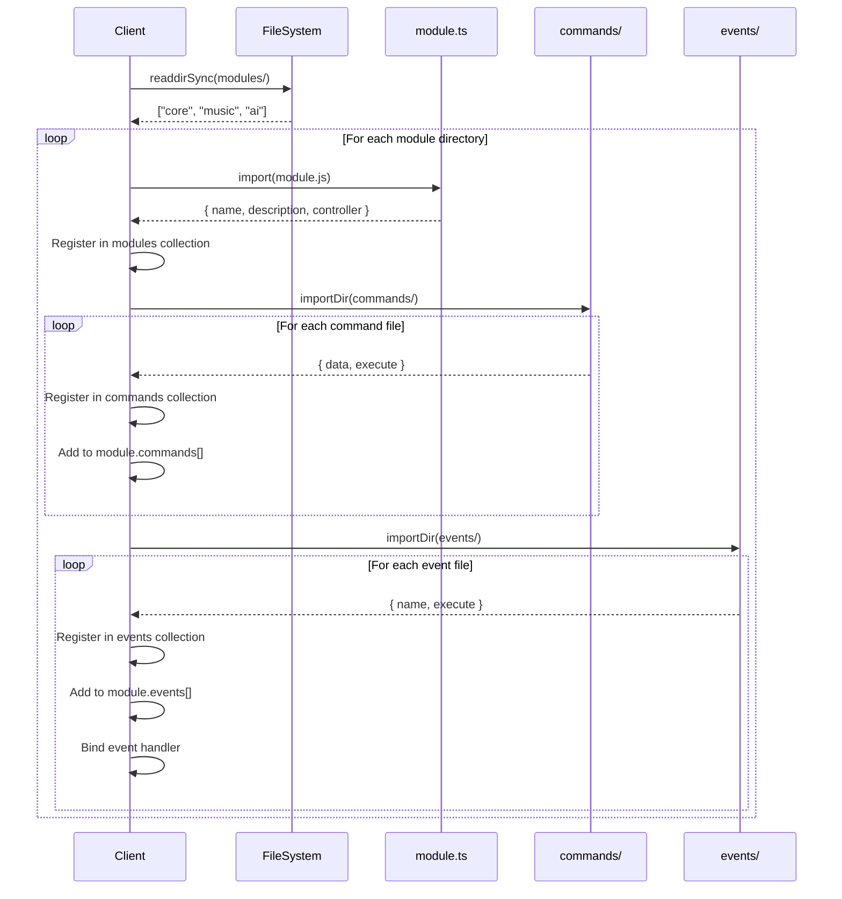

# 3.3 Module System

The Module System is Quetza's plugin architecture, enabling self-contained feature sets to be added without modifying the core framework.

## 3.3.1 Module Architecture

Modules are the primary organizational unit in Quetza. Each module is a self-contained package of related functionality.

### Module Characteristics

- **Self-Contained**: Everything needed for the module exists in its directory
- **Isolated**: Modules don't directly depend on each other
- **Discoverable**: Automatically loaded from the `modules/` directory
- **Consistent**: All modules follow the same structure and interface
- **Optional Controller**: May include a controller for state management

### Module Directory Structure

```
modules/
├── core/                    # Core functionality module
│   ├── module.ts           # Module definition
│   ├── commands/           # Slash commands
│   │   ├── ping.ts
│   │   └── modules.ts
│   ├── events/             # Event handlers
│   │   ├── ready.ts
│   │   └── interaction-create.ts
│   ├── lib/                # Module-specific utilities
│   │   └── replies.ts
│   └── tsconfig.json       # Module TypeScript config
│
├── music/                   # Music playback module
│   ├── module.ts           # Exports Music controller
│   ├── commands/           # Music commands (play, pause, etc.)
│   ├── events/             # Voice state events
│   ├── lib/                # Player, Queue, Fetcher, etc.
│   └── tsconfig.json
│
└── ai/                      # AI conversation module
    ├── module.ts           # Exports AI controller
    ├── commands/           # AI commands (ask, askclear)
    ├── lib/                # Llama client, conversations
    └── tsconfig.json
```

## 3.3.2 Module Structure

Every module follows a standardized structure:

### Required Components

1. **module.ts** - Module definition file (required)
2. **commands/** - Directory for slash commands (optional)
3. **events/** - Directory for event handlers (optional)
4. **tsconfig.json** - TypeScript configuration for the module (required for TypeScript projects)

### Optional Components

1. **lib/** - Module-specific libraries, utilities, classes
2. **types.ts** - Module-specific type definitions
3. **README.md** - Module documentation

### File Organization

```
module-name/
├── module.ts              # Module definition and exports
├── commands/              # Slash command handlers
│   ├── command1.ts        # Individual command file
│   └── command2.ts
├── events/                # Discord event handlers  
│   ├── event1.ts          # Individual event handler
│   └── event2.ts
├── lib/                   # Module implementation
│   ├── controller.ts      # Optional controller class
│   ├── types.ts           # Module-specific types
│   ├── utilities.ts       # Helper functions
│   └── ...                # Other implementation files
└── tsconfig.json          # TypeScript config (extends root)
```

## 3.3.3 Module Definition

The `module.ts` file defines the module's metadata and exports its controller (if any).

### Basic Module Definition

```typescript
// modules/core/module.ts
const name = "core";
const description = "Quetza's core functionality";

export { description, name };
```

### Module Definition Interface

```typescript
// src/lib/types.ts
export interface ModuleBase {
    /** Name of a module. */
    name: string;

    /** Description of a module. */
    description: string;

    /** Module controller. */
    controller?: unknown;
}
```

### Module with Controller

```typescript
// modules/music/module.ts
import Music from "./lib/music.js";

const name = "music";
const description = "Music module";

const controller = new Music();

export { controller, description, name };
```

### Module Naming Conventions

- **name**: Lowercase, no spaces (e.g., `"core"`, `"music"`, `"ai"`)
- **Directory name**: Must match the module name
- **Description**: Brief one-line description of module purpose

## 3.3.4 Module Loading and Registration

Modules are automatically discovered and loaded during client initialization.

### Loading Process



### Registration Code

```typescript
// src/lib/client.ts
public constructor(options: ClientOptions) {
    super(options);

    readdirSync(config.path.modules).forEach((module) =>
        this.importModule(
            toModuleDeclaration(module),
            toModuleCommands(module),
            toModuleEvents(module)
        )
    );
}
```

### Import Module Implementation

```typescript
private async importModule(
    declaration: string,
    commands: string,
    events: string
): Promise<void> {
    // 1. Import and register module definition
    const module = await import(declaration).then((module: ModuleBase) =>
        this.modules.ensure(module.name, () => ({ 
            ...module, 
            commands: [], 
            events: [] 
        }))
    );

    // 2. Import and register commands
    importDir<CommandBase>(commands, (command) => {
        const saved = this.commands.ensure(command.data.name, () => ({ 
            ...command, 
            module 
        }));
        module.commands.push(saved);
    });

    // 3. Import and register events
    importDir<EventBase>(events, (event) => {
        const saved = this.events.ensure(event.name, () => ({ 
            ...event, 
            module 
        }));
        module.events.push(saved);
        this.on(event.name, (...eventee: unknown[]) =>
            saved.execute(this, eventee, module.controller)
        );
    });
}
```

### Path Resolution

Helper functions create paths to module components:

```typescript
// src/lib/client.ts
const toModuleDeclaration = pathThrough([config.path.modules], ["module.js"]);
const toModuleCommands = pathThrough([config.path.modules], ["commands"]);
const toModuleEvents = pathThrough([config.path.modules], ["events"]);

// Usage:
// toModuleDeclaration("music") → "/path/to/modules/music/module.js"
// toModuleCommands("music")    → "/path/to/modules/music/commands"
// toModuleEvents("music")      → "/path/to/modules/music/events"
```

### Import Directory Utility

```typescript
// src/lib/misc.ts
export function importDir<T>(dir: string, callback: (module: T) => void) {
    if (!existsSync(dir)) {
        return;  // Silently skip if directory doesn't exist
    }

    readdirSync(dir)
        .filter((source) => source.endsWith(".js"))
        .forEach((source) => import(pathToURI(dir, source)).then(callback));
}
```

**Key Behaviors:**
- Returns early if directory doesn't exist (allows optional commands/events)
- Only imports `.js` files (compiled TypeScript)
- Asynchronous imports with callbacks
- Type-safe with generic parameter

## 3.3.5 Module Dependencies

Modules in Quetza are designed to be **independent** with minimal direct dependencies.

### Shared Dependencies

All modules have access to:

1. **Client Instance**: Passed to all execute functions
2. **Core Libraries**: `$lib/logger`, `$lib/types`, etc.
3. **Configuration**: `$config` for application settings
4. **Discord.js**: Full Discord.js functionality

### Accessing Other Modules

Modules **should not** directly import from other modules. Instead:

#### Via Client Collections

```typescript
// Access another module's commands (read-only)
const pingCommand = client.commands.get('ping');

// Access another module's controller
const musicModule = client.modules.get('music');
const musicController = musicModule?.controller as Music;
```

#### Via Shared Services

```typescript
// Logger is shared across all modules
import logger from "$lib/logger.js";

logger.info("Module operation", { context });
```

### Module Isolation Benefits

1. **Independent Development**: Modules can be developed in parallel
2. **Easy Testing**: Mock dependencies at boundaries
3. **Clear Contracts**: Interactions happen through well-defined interfaces
4. **Reduced Coupling**: Changes in one module don't break others
5. **Optional Features**: Modules can be enabled/disabled by presence

### TypeScript Project References

Modules use TypeScript project references for compilation:

```json
// Root tsconfig.json
{
  "references": [
    { "path": "./modules/core" },
    { "path": "./modules/music" },
    { "path": "./modules/ai" }
  ]
}
```

```json
// modules/music/tsconfig.json
{
  "extends": "../../config.tsconfig.json",
  "compilerOptions": {
    "composite": true,
    "outDir": "../../dist/modules/music",
    "rootDir": "./"
  }
}
```

This enables:
- **Incremental compilation**: Only changed modules rebuild
- **Better IDE support**: Jump-to-definition across modules
- **Type checking**: Maintains type safety across boundaries

## 3.3.6 Module Controllers

Controllers are optional classes that manage module-level state and provide services to commands and events.

### Controller Purpose

Controllers solve the problem of **state management** in a stateless command/event architecture:

- Commands are stateless functions
- Events are stateless handlers
- State needs to persist across invocations

**Controllers provide:**
- Persistent state management
- Service orchestration
- Complex business logic
- Resource lifecycle management

### Controller Example: Music Module

```typescript
// modules/music/lib/music.ts
export default class Music {
    /**
     * GuildId to Player mapping.
     */
    private players_ = new Collection<string, Player>();

    /**
     * Retrieves Player by Guild.
     */
    public get(guild: Guild, channel?: GuildTextBasedChannel): Player | undefined {
        const player = this.players_.get(guild.id);

        if (player) {
            if (channel) {
                player.channel = channel;
            }
            return player;
        }
    }

    /**
     * Creates Player and maps it to GuildId.
     */
    public set(guild: Guild, channel: GuildTextBasedChannel): Player {
        const player = new Player(guild, this, channel);
        this.players_.set(guild.id, player);
        logger.info("Player was created.", { player });
        return player;
    }

    /**
     * Deletes Player and its mapping.
     */
    public delete(guildId: string): void {
        logger.info("Player was deleted.", { guildId });
        this.players_.delete(guildId);
    }
}
```

### Controller Export

```typescript
// modules/music/module.ts
import Music from "./lib/music.js";

const name = "music";
const description = "Music module";

const controller = new Music();  // Singleton instance

export { controller, description, name };
```

### Controller Access in Commands

```typescript
// modules/music/commands/play.ts
async function execute(
    client: Client,
    interaction: CommandInteraction,
    controller?: unknown
): Promise<void> {
    // Type assertion to access controller
    const music = controller as Music;
    
    // Get or create player for this guild
    let player = music.get(interaction.guild);
    if (!player) {
        player = music.set(interaction.guild, interaction.channel);
    }
    
    // Use player to play music
    await player.play(url);
}
```

### Controller Patterns

#### 1. Registry Pattern

Mapping entities to resources:

```typescript
class Music {
    private players_ = new Collection<string, Player>();
    
    public get(guildId: string): Player | undefined
    public set(guildId: string, player: Player): void
    public delete(guildId: string): void
}
```

#### 2. Factory Pattern

Creating and managing instances:

```typescript
class Music {
    public set(guild: Guild, channel: GuildTextBasedChannel): Player {
        const player = new Player(guild, this, channel);
        this.players_.set(guild.id, player);
        return player;
    }
}
```

#### 3. Lifecycle Management

Managing resource creation and cleanup:

```typescript
class Music {
    public set(guild: Guild, channel: GuildTextBasedChannel): Player {
        // Create
        const player = new Player(guild, this, channel);
        this.players_.set(guild.id, player);
        return player;
    }
    
    public delete(guildId: string): void {
        // Cleanup
        const player = this.players_.get(guildId);
        player?.cleanup();
        this.players_.delete(guildId);
    }
}
```

### Controller Best Practices

1. **Keep controllers focused**: One controller per module
2. **Controller as singleton**: Export a single instance from `module.ts`
3. **Type safety**: Commands should type-assert the controller
4. **Logging**: Controllers should log significant state changes
5. **Error handling**: Handle errors gracefully within controller methods
6. **Thread safety**: Consider concurrent access in async operations

## Module Complete Type

After loading, modules have this complete structure:

```typescript
export interface Module extends ModuleBase {
    name: string;
    description: string;
    controller?: unknown;
    commands: Command[];     // Populated during loading
    events: Event[];         // Populated during loading
}
```

## Creating a New Module

To create a new module:

1. **Create directory**: `modules/my-module/`
2. **Add module.ts**: Define name, description, optional controller
3. **Add tsconfig.json**: Extend root configuration
4. **Create commands/**: Add command files as needed
5. **Create events/**: Add event handlers as needed
6. **Create lib/**: Add implementation code
7. **Update root tsconfig.json**: Add project reference

The module will be automatically discovered and loaded on next startup.

## Related Documentation

- [Client System](./02-client-system.md) - How client loads modules
- [Command System](./04-command-system.md) - Creating module commands
- [Event System](./05-event-system.md) - Creating module events
- [Development Guide: Creating a New Module](../05-development-guide/03-creating-new-module.md)
