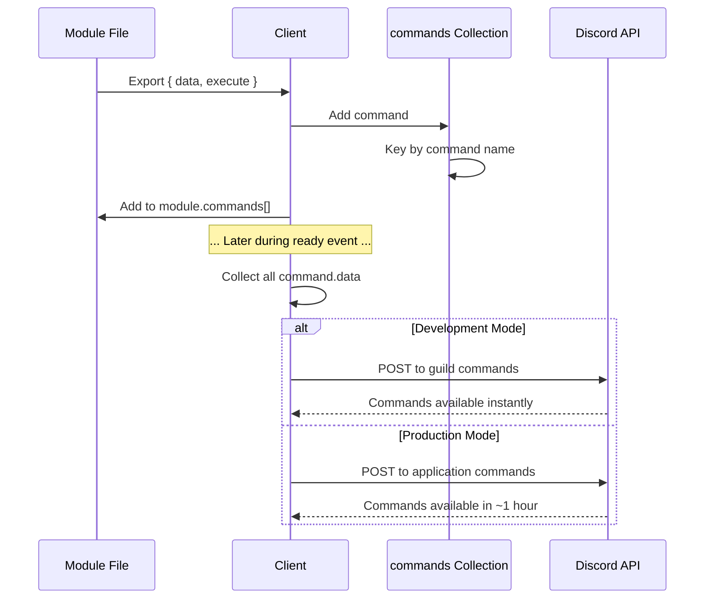
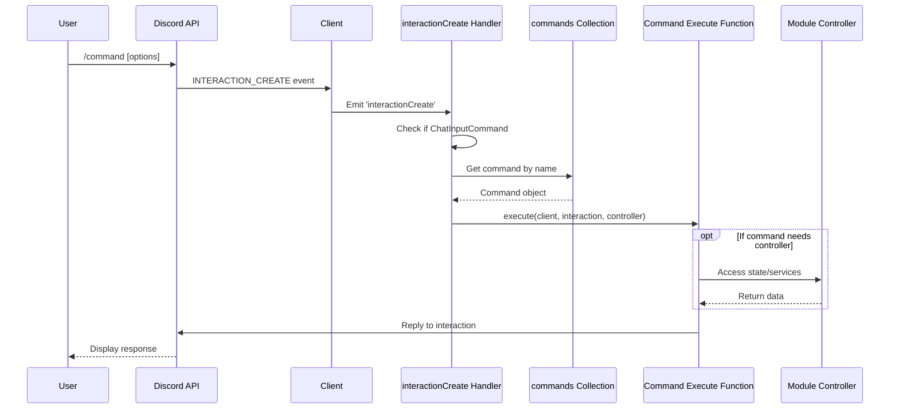
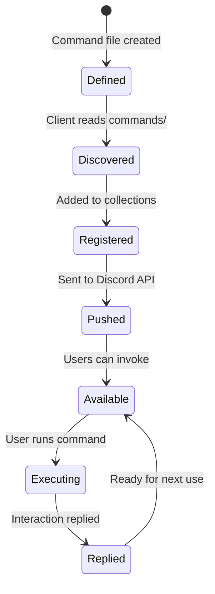

# 3.4 Command System

The Command System handles Discord slash command registration, execution, and error handling. All user interactions with Quetza go through this system.

## 3.4.1 Command Interface

Commands in Quetza implement the `CommandBase` interface:

```typescript
// src/lib/types.ts
export interface CommandBase {
    /** Command metadata that will be passed to the Discord API. */
    data: ApplicationCommandData;

    /** Function that will be executed upon invoking this interaction. */
    execute: (
        client: Client,
        interaction: CommandInteraction,
        controller?: unknown
    ) => Promise<void>;
}
```

### Complete Command Type

When registered with the client, commands gain a reference to their parent module:

```typescript
export interface Command extends CommandBase {
    /** Module containing this Command. */
    module: Module;
}
```

### Command File Structure

Every command file exports `data` and `execute`:

```typescript
// modules/core/commands/ping.ts
import { ChatInputCommandInteraction, SlashCommandBuilder } from "discord.js";
import Client from "$lib/client.js";
import replies from "../lib/replies.js";

async function execute(
    client: Client,
    interaction: ChatInputCommandInteraction
): Promise<void> {
    if (!interaction.isChatInputCommand()) {
        return;
    }

    const reply = await interaction.reply({ 
        ...replies.ping(client.ws.ping), 
        fetchReply: true 
    });

    await interaction.editReply(
        replies.ping(client.ws.ping, reply.createdTimestamp - interaction.createdTimestamp)
    );
}

const data = new SlashCommandBuilder()
    .setName("ping")
    .setDescription("Try to ping me.");

export { data, execute };
```

### Command Components

1. **Imports**: Required Discord.js types and utilities
2. **execute function**: Async function handling command logic
3. **data object**: SlashCommandBuilder defining command structure
4. **exports**: Named exports of `data` and `execute`

## 3.4.2 Command Registration

Commands are registered through a multi-step process:

### Step 1: File Discovery

```typescript
// src/lib/client.ts
importDir<CommandBase>(commands, (command) => {
    const saved = this.commands.ensure(command.data.name, () => ({ 
        ...command, 
        module 
    }));
    module.commands.push(saved);
});
```

The client imports all `.js` files from each module's `commands/` directory.

### Step 2: Local Registration

Commands are added to the client's `commands` Collection:

```typescript
this.commands.ensure(command.data.name, () => ({ 
    ...command,  // data and execute from file
    module       // reference to parent module
}));
```

**Key points:**
- Commands are keyed by name
- Each command gets a reference to its module
- The module maintains a list of its commands

### Step 3: Discord API Registration

During the `ready` event, commands are registered with Discord:

```typescript
// modules/core/events/ready.ts
async function execute(client: Client<true>): Promise<void> {
    const commandData = client.commands.map((value) => value.data);

    if (process.env.NODE_ENV === "development") {
        // Register to test guild (instant updates)
        const guild = await client.guilds.fetch(config.dev.guild);
        guild.commands.set(commandData);
    }

    if (process.env.NODE_ENV === "production") {
        // Register globally (takes up to 1 hour to propagate)
        await client.application.commands.set(commandData);
    }
}
```

### Registration Flow Diagram



## 3.4.3 Command Execution Flow

When a user invokes a slash command:



### Interaction Create Event Handler

```typescript
// modules/core/events/interaction-create.ts
async function execute(client: Client, eventee: [Interaction]): Promise<void> {
    const [interaction] = eventee;

    // 1. Validate interaction type
    if (!interaction.isChatInputCommand()) {
        logger.notice("Interaction is not a ChatInputCommand.");
        return;
    }

    // 2. Retrieve command from registry
    const command = client.commands.get(interaction.commandName);

    if (!command) {
        logger.notice("Interaction does not exist.", interaction);
        return;
    }

    // 3. Execute command with error handling
    try {
        logger.info("Interaction was created.", interaction);
        
        await command.execute(
            client, 
            interaction, 
            command.module.controller
        );
    } catch (error) {
        logger.error("Interaction has and error occured.", error, interaction);
    }
}
```

### Execute Function Parameters

```typescript
async function execute(
    client: Client,              // Full client instance
    interaction: CommandInteraction,  // The interaction that triggered command
    controller?: unknown         // Module controller (if defined)
): Promise<void>
```

1. **client**: Access to Discord client, collections, and methods
2. **interaction**: Contains command name, options, user, guild, channel, etc.
3. **controller**: Module's controller instance (needs type assertion)

## 3.4.4 Slash Command Integration

Quetza uses Discord.js's `SlashCommandBuilder` for type-safe command definitions.

### Basic Command

```typescript
const data = new SlashCommandBuilder()
    .setName("ping")
    .setDescription("Try to ping me.");
```

### Command with Options

```typescript
const data = new SlashCommandBuilder()
    .setName("play")
    .setDescription("Play music from URL or search query")
    .addStringOption(option =>
        option
            .setName("query")
            .setDescription("URL or search query")
            .setRequired(true)
    )
    .addBooleanOption(option =>
        option
            .setName("next")
            .setDescription("Add to front of queue")
            .setRequired(false)
    );
```

### Command with Choices

```typescript
const data = new SlashCommandBuilder()
    .setName("loop")
    .setDescription("Set loop mode")
    .addStringOption(option =>
        option
            .setName("mode")
            .setDescription("Loop mode to set")
            .setRequired(true)
            .addChoices(
                { name: "Off", value: "NONE" },
                { name: "Loop Queue", value: "LOOP" },
                { name: "Loop Song", value: "SONG" },
                { name: "Autoplay", value: "AUTO" }
            )
    );
```

### Accessing Options

```typescript
async function execute(
    client: Client,
    interaction: CommandInteraction
): Promise<void> {
    // String option
    const query = interaction.options.getString("query", true);  // true = required
    
    // Boolean option
    const next = interaction.options.getBoolean("next") ?? false;
    
    // Integer option
    const position = interaction.options.getInteger("position", true);
    
    // User option
    const user = interaction.options.getUser("user");
    
    // Channel option
    const channel = interaction.options.getChannel("channel");
}
```

### Option Types

| Method | Type | Description |
|--------|------|-------------|
| `getString()` | String | Text input |
| `getInteger()` | Integer | Whole numbers |
| `getNumber()` | Number | Decimal numbers |
| `getBoolean()` | Boolean | True/false toggle |
| `getUser()` | User | Discord user mention |
| `getChannel()` | Channel | Channel mention |
| `getRole()` | Role | Role mention |
| `getMentionable()` | User/Role | Any mentionable |
| `getAttachment()` | Attachment | File upload |

## 3.4.5 Command Permissions

While Quetza doesn't implement custom permission checks in the current architecture, Discord provides built-in permission controls:

### Server-Level Permissions

Server administrators can:
- Enable/disable commands per channel
- Restrict commands to specific roles
- Set command permissions per user

This is configured through Discord's native slash command permissions UI.

### Voice State Checks

Music commands often check if user is in a voice channel:

```typescript
async function execute(
    client: Client,
    interaction: CommandInteraction,
    controller?: unknown
): Promise<void> {
    const member = interaction.member as GuildMember;
    
    // Check if user is in a voice channel
    if (!member.voice.channel) {
        await interaction.reply({
            content: "You must be in a voice channel!",
            ephemeral: true
        });
        return;
    }
    
    // Proceed with command logic
}
```

### Custom Permission Patterns

For module-specific permissions, common patterns include:

```typescript
// Role-based check
const hasRole = member.roles.cache.has(requiredRoleId);

// Permission-based check
const hasPermission = member.permissions.has(PermissionFlagsBits.Administrator);

// Channel-based check
const isInCorrectChannel = interaction.channelId === allowedChannelId;
```

## 3.4.6 Command Error Handling

Error handling occurs at multiple levels:

### Level 1: Command-Level Try-Catch

Individual commands handle expected errors:

```typescript
async function execute(
    client: Client,
    interaction: CommandInteraction,
    controller?: unknown
): Promise<void> {
    try {
        const music = controller as Music;
        const player = music.get(interaction.guild);
        
        if (!player) {
            throw new MusicError("No active player", "NO_PLAYER");
        }
        
        await player.play(url);
        
    } catch (error) {
        if (error instanceof MusicError) {
            await interaction.reply({
                content: error.message,
                ephemeral: true
            });
        } else {
            throw error;  // Re-throw unexpected errors
        }
    }
}
```

### Level 2: Interaction Handler Try-Catch

The `interactionCreate` event handler catches all command errors:

```typescript
// modules/core/events/interaction-create.ts
try {
    logger.info("Interaction was created.", interaction);
    
    await command.execute(client, interaction, command.module.controller);
    
} catch (error) {
    logger.error("Interaction has and error occured.", error, interaction);
}
```

This prevents errors from crashing the bot.

### Level 3: Reply Error Handling

Interaction replies have time constraints (3 seconds for initial reply):

```typescript
async function execute(
    client: Client,
    interaction: CommandInteraction
): Promise<void> {
    // Defer reply for long operations
    await interaction.deferReply();
    
    try {
        const result = await longRunningOperation();
        
        await interaction.editReply({
            content: `Result: ${result}`
        });
        
    } catch (error) {
        await interaction.editReply({
            content: "An error occurred during processing."
        });
    }
}
```

### Custom Error Classes

Modules can define custom errors:

```typescript
// modules/music/lib/MusicError.ts
export default class MusicError extends Error {
    public readonly code: string;

    constructor(message: string, code: string) {
        super(message);
        this.name = "MusicError";
        this.code = code;
    }
}
```

### Error Response Patterns

#### Ephemeral Error Messages

```typescript
await interaction.reply({
    content: "❌ Error: Invalid input",
    ephemeral: true  // Only visible to user who ran command
});
```

#### Formatted Error Embeds

```typescript
import { EmbedBuilder } from "discord.js";
import config from "$config.js";

await interaction.reply({
    embeds: [
        new EmbedBuilder()
            .setTitle("Error")
            .setDescription(error.message)
            .setColor(config.colors.error)
    ],
    ephemeral: true
});
```

#### Retry Suggestions

```typescript
await interaction.reply({
    content: "❌ Connection failed. Try again in a moment.",
    ephemeral: true
});
```

## Command Reply System

Most modules implement a reply system for consistent responses:

```typescript
// modules/core/lib/replies.ts
import { EmbedBuilder, InteractionReplyOptions } from "discord.js";
import config from "$config.js";

const replies = {
    ping(ws: number, rest = 0): InteractionReplyOptions {
        return {
            embeds: [
                new EmbedBuilder()
                    .setTitle("Pong!")
                    .setDescription(`WebSocket: ${ws}ms\nRound-trip: ${rest}ms`)
                    .setColor(config.colors.info)
            ]
        };
    }
};

export default replies;
```

Usage in commands:

```typescript
await interaction.reply(replies.ping(client.ws.ping));
```

## Best Practices

1. **Always handle interactions**: Reply or defer within 3 seconds
2. **Use ephemeral for errors**: Keep error messages private
3. **Defer long operations**: Use `interaction.deferReply()` for operations >2s
4. **Type-check interactions**: Verify interaction type before accessing type-specific properties
5. **Validate options**: Check required options and ranges
6. **Type-assert controllers**: Cast `controller` to expected type
7. **Log important actions**: Use logger for debugging and monitoring
8. **Use embeds for rich content**: Format responses with EmbedBuilder
9. **Handle edge cases**: Check for null/undefined guild, member, channel
10. **Follow naming conventions**: Use lowercase command names, clear descriptions

## Command Lifecycle



## Related Documentation

- [Module System](./03-module-system.md) - How commands fit into modules
- [Event System](./05-event-system.md) - Event handling and interactionCreate
- [Type System](./08-type-system.md) - Command type definitions
- [Development Guide: Creating Commands](../05-development-guide/04-creating-commands.md)
