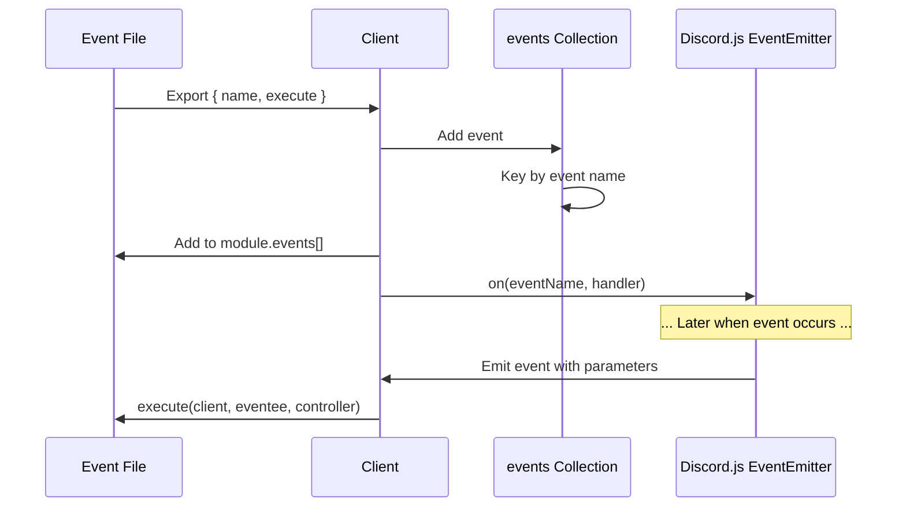
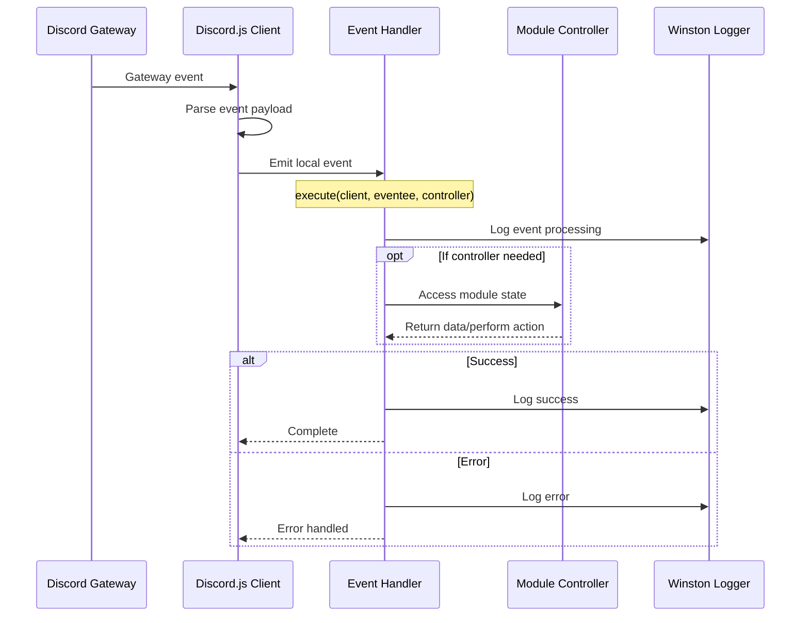
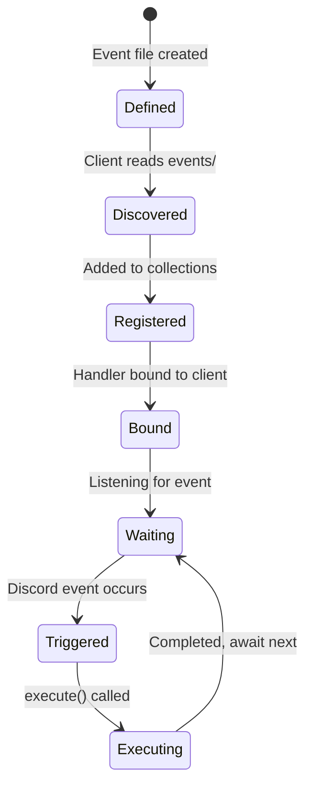

# 3.5 Event System

The Event System handles Discord events and custom application events. Events are the primary way Quetza responds to changes in Discord (user actions, voice states, messages, etc.).

## 3.5.1 Event Interface

Events in Quetza implement the `EventBase` interface:

```typescript
// src/lib/types.ts
export interface EventBase {
    /** Name of an event to listen. */
    name: string;

    /** Function that will be executed upon event emitting. */
    execute: (
        client: Client,
        eventee: unknown[],
        controller?: unknown
    ) => Promise<void>;
}
```

### Complete Event Type

When registered with the client, events gain a reference to their parent module:

```typescript
export interface Event extends EventBase {
    /** Module containing this Event. */
    module: ModuleBase;
}
```

### Event File Structure

Every event file exports `name` and `execute`:

```typescript
// modules/core/events/ready.ts
import { Events } from "discord.js";
import Client from "$lib/client.js";
import logger from "$lib/logger.js";

async function execute(client: Client<true>): Promise<void> {
    const commandData = client.commands.map((value) => value.data);

    if (process.env.NODE_ENV === "development") {
        logger.info(
            "Development mode: Commands will be pushed to the _test guild_!",
            client.generateApplicationStatus()
        );
        
        const guild = await client.guilds.fetch(config.dev.guild);
        guild.commands.set(commandData);
    }

    if (process.env.NODE_ENV === "production") {
        logger.info(
            "Production mode: Commands will be pushed to the _application_!",
            client.generateApplicationStatus()
        );
        
        await client.application.commands.set(commandData);
    }

    client.user.setActivity(config.application.activity);
}

const name = Events.ClientReady;

export { execute, name };
```

### Event Components

1. **Imports**: Discord.js Events enum and required utilities
2. **execute function**: Async function handling event logic
3. **name constant**: Discord event name (from Events enum)
4. **exports**: Named exports of `name` and `execute`

## 3.5.2 Event Registration

Events are registered during module loading:

### Step 1: File Discovery

```typescript
// src/lib/client.ts
importDir<EventBase>(events, (event) => {
    const saved = this.events.ensure(event.name, () => ({ 
        ...event, 
        module 
    }));
    
    module.events.push(saved);
    
    // Bind event handler to Discord.js client
    this.on(event.name, (...eventee: unknown[]) =>
        saved.execute(this, eventee, module.controller)
    );
});
```

The client imports all `.js` files from each module's `events/` directory.

### Step 2: Collection Registration

Events are added to the client's `events` Collection:

```typescript
this.events.ensure(event.name, () => ({ 
    ...event,  // name and execute from file
    module     // reference to parent module
}));
```

### Step 3: Handler Binding

The crucial step that connects events to Discord.js:

```typescript
this.on(event.name, (...eventee: unknown[]) =>
    saved.execute(this, eventee, module.controller)
);
```

**What happens:**
1. Registers a listener for the Discord event
2. When event fires, passes all event parameters to execute function
3. Injects client and module controller automatically

### Registration Flow Diagram



## 3.5.3 Discord Event Handling

Quetza responds to Discord.js events. These correspond to Discord Gateway events.

### Common Discord Events

| Event Name | Trigger | Usage in Quetza |
|------------|---------|-----------------|
| `ready` | Bot connects and is ready | Register commands, set status |
| `interactionCreate` | User creates interaction | Dispatch slash commands |
| `voiceStateUpdate` | User joins/leaves voice | Music player cleanup |
| `messageCreate` | Message sent | (Future: message commands) |
| `guildMemberAdd` | User joins server | (Future: welcome messages) |
| `guildCreate` | Bot joins server | (Future: setup wizard) |

### Using Events Enum

Discord.js provides type-safe event names:

```typescript
import { Events } from "discord.js";

const name = Events.ClientReady;         // "ready"
const name = Events.InteractionCreate;   // "interactionCreate"
const name = Events.VoiceStateUpdate;    // "voiceStateUpdate"
```

**Benefits:**
- Type safety
- Autocomplete in IDE
- Refactoring support
- Avoids typos

### Event Parameters

Each Discord event provides specific parameters:

#### ready Event

```typescript
async function execute(client: Client<true>): Promise<void> {
    // client is guaranteed to be ready
    console.log(`Logged in as ${client.user.tag}`);
}

const name = Events.ClientReady;
```

**Note:** `client` parameter is `Client<true>`, guaranteeing ready state.

#### interactionCreate Event

```typescript
async function execute(
    client: Client,
    eventee: [Interaction]
): Promise<void> {
    const [interaction] = eventee;
    
    if (interaction.isChatInputCommand()) {
        // Handle slash command
    }
}

const name = Events.InteractionCreate;
```

**Parameters:**
- `interaction`: The interaction that was created

#### voiceStateUpdate Event

```typescript
async function execute(
    client: Client,
    eventee: [VoiceState, VoiceState],
    controller?: unknown
): Promise<void> {
    const [oldState, newState] = eventee;
    
    // Check if bot was disconnected
    if (oldState.channelId && !newState.channelId) {
        const music = controller as Music;
        music.delete(oldState.guild.id);
    }
}

const name = Events.VoiceStateUpdate;
```

**Parameters:**
- `oldState`: Voice state before update
- `newState`: Voice state after update

## 3.5.4 Event Execution Flow



### Execute Function Parameters

```typescript
async function execute(
    client: Client,        // Full client instance
    eventee: unknown[],    // Event parameters (varies by event)
    controller?: unknown   // Module controller (if defined)
): Promise<void>
```

1. **client**: Access to Discord client and collections
2. **eventee**: Array of event-specific parameters
3. **controller**: Module's controller instance (needs type assertion)

### Parameter Destructuring

Events typically destructure the `eventee` array:

```typescript
// Single parameter
async function execute(client: Client, eventee: [Interaction]) {
    const [interaction] = eventee;
}

// Multiple parameters
async function execute(client: Client, eventee: [VoiceState, VoiceState]) {
    const [oldState, newState] = eventee;
}

// No parameters (ready event receives client directly)
async function execute(client: Client<true>) {
    // No eventee needed
}
```

## 3.5.5 Multiple Event Handlers

Multiple modules can register handlers for the same event.

### How It Works

```typescript
// Core module: ready event
const name = Events.ClientReady;
export { execute, name };

// Music module: ready event (if it had one)
const name = Events.ClientReady;
export { execute, name };

// Both would execute when ready event fires
```

### Execution Order

Event handlers execute in the order modules are loaded:

1. Modules are loaded alphabetically by directory name
2. Events are registered in module load order
3. Discord.js calls handlers in registration order

**Example:**
```
modules/
├── ai/         # Loads first
├── core/       # Loads second
└── music/      # Loads third
```

If all three have a `ready` event:
1. ai/events/ready.ts executes
2. core/events/ready.ts executes
3. music/events/ready.ts executes

### Independent Execution

Each handler is **independent**:
- Errors in one handler don't stop others
- Handlers can't access each other's data
- No guaranteed completion order (they're async)

### Use Cases for Multiple Handlers

1. **Module initialization**: Each module sets up its state on `ready`
2. **Monitoring**: Multiple modules track the same event
3. **Separation of concerns**: Different aspects of same event handled separately

### Example: voiceStateUpdate

```typescript
// Music module: Clean up player
async function execute(
    client: Client,
    eventee: [VoiceState, VoiceState],
    controller?: unknown
) {
    const [oldState, newState] = eventee;
    const music = controller as Music;
    
    if (oldState.channelId && !newState.channelId) {
        music.delete(oldState.guild.id);
    }
}

// Hypothetical stats module: Track voice activity
async function execute(
    client: Client,
    eventee: [VoiceState, VoiceState],
    controller?: unknown
) {
    const [oldState, newState] = eventee;
    const stats = controller as Stats;
    
    stats.recordVoiceChange(oldState, newState);
}
```

Both handlers would execute independently when a voice state changes.

## 3.5.6 Event Error Handling

Event handlers should handle errors gracefully to prevent bot crashes.

### Try-Catch Pattern

```typescript
async function execute(
    client: Client,
    eventee: [Interaction],
    controller?: unknown
): Promise<void> {
    const [interaction] = eventee;
    
    try {
        // Event logic
        const command = client.commands.get(interaction.commandName);
        await command.execute(client, interaction, controller);
        
    } catch (error) {
        logger.error("Error in interactionCreate handler", error);
        
        // Attempt to notify user
        if (interaction.isRepliable() && !interaction.replied) {
            await interaction.reply({
                content: "An error occurred processing your command.",
                ephemeral: true
            }).catch(() => {
                // If reply fails, log and continue
                logger.error("Failed to send error reply");
            });
        }
    }
}
```

### Logging Errors

Always log errors for debugging:

```typescript
catch (error) {
    logger.error("Event handler error", {
        event: name,
        error: error,
        context: additionalContext
    });
}
```

### Partial Failures

Handle failures gracefully without stopping the entire operation:

```typescript
async function execute(client: Client<true>): Promise<void> {
    try {
        await client.application.commands.set(commandData);
        logger.info("Commands registered successfully");
    } catch (error) {
        logger.error("Failed to register commands", error);
        // Bot continues to run, commands just won't update
    }
    
    try {
        client.user.setActivity(config.application.activity);
        logger.info("Activity status set");
    } catch (error) {
        logger.error("Failed to set activity", error);
        // Bot continues to run, status just won't show
    }
}
```

### Event-Specific Error Patterns

#### interactionCreate Errors

```typescript
try {
    await command.execute(client, interaction, command.module.controller);
} catch (error) {
    logger.error("Command execution failed", error, interaction);
    
    // Try to inform user
    const reply = {
        content: "An error occurred executing this command.",
        ephemeral: true
    };
    
    if (!interaction.replied && !interaction.deferred) {
        await interaction.reply(reply).catch(() => {});
    } else {
        await interaction.editReply(reply).catch(() => {});
    }
}
```

#### voiceStateUpdate Errors

```typescript
try {
    music.delete(oldState.guild.id);
} catch (error) {
    logger.error("Failed to clean up player", {
        error,
        guildId: oldState.guild.id
    });
    // Don't throw - allow other cleanup to continue
}
```

## Event Examples

### Ready Event (Core Module)

```typescript
// modules/core/events/ready.ts
import { generateDependencyReport } from "@discordjs/voice";
import { Events } from "discord.js";
import config from "$config.js";
import Client from "$lib/client.js";
import logger from "$lib/logger.js";

async function execute(client: Client<true>): Promise<void> {
    const commandData = client.commands.map((value) => value.data);

    if (process.env.NODE_ENV === "development") {
        logger.info(
            "Development mode: Commands will be pushed to the _test guild_!",
            client.generateApplicationStatus()
        );
        logger.info("Dependency report by '@discordjs/voice'.", {
            report: generateDependencyReport()
        });

        const guild = await client.guilds.fetch(config.dev.guild);
        guild.commands.set(commandData);
    }

    if (process.env.NODE_ENV === "production") {
        logger.info(
            "Production mode: Commands will be pushed to the _application_!",
            client.generateApplicationStatus()
        );

        await client.application.commands.set(commandData);
    }

    client.user.setActivity(config.application.activity);
}

const name = Events.ClientReady;

export { execute, name };
```

### InteractionCreate Event (Core Module)

```typescript
// modules/core/events/interaction-create.ts
import { Events, Interaction } from "discord.js";
import Client from "$lib/client.js";
import logger from "$lib/logger.js";

async function execute(client: Client, eventee: [Interaction]): Promise<void> {
    const [interaction] = eventee;

    if (!interaction.isChatInputCommand()) {
        logger.notice("Interaction is not a ChatInputCommand.");
        return;
    }

    const command = client.commands.get(interaction.commandName);

    if (!command) {
        logger.notice("Interaction does not exist.", interaction);
        return;
    }

    try {
        logger.info("Interaction was created.", interaction);

        await command.execute(client, interaction, command.module.controller);
    } catch (error) {
        logger.error("Interaction has and error occured.", error, interaction);
    }
}

const name = Events.InteractionCreate;

export { execute, name };
```

### VoiceStateUpdate Event (Music Module)

```typescript
// modules/music/events/voice-state-update.ts
import { Events, VoiceState } from "discord.js";
import Client from "$lib/client.js";
import logger from "$lib/logger.js";
import Music from "../lib/music.js";

async function execute(
    client: Client,
    eventee: [VoiceState, VoiceState],
    controller?: unknown
): Promise<void> {
    const [oldState, newState] = eventee;
    const music = controller as Music;

    // Bot was disconnected from voice channel
    if (oldState.channelId && !newState.channelId && oldState.member?.id === client.user?.id) {
        logger.info("Bot disconnected from voice, cleaning up player", {
            guildId: oldState.guild.id
        });
        
        music.delete(oldState.guild.id);
    }
}

const name = Events.VoiceStateUpdate;

export { execute, name };
```

## Best Practices

1. **Use Events enum**: Import from Discord.js for type safety
2. **Destructure eventee**: Extract parameters immediately for clarity
3. **Type assertions for controller**: Cast to expected type when needed
4. **Always log**: Log event processing for debugging
5. **Handle errors gracefully**: Use try-catch, don't crash the bot
6. **Keep handlers focused**: Each handler should do one thing well
7. **Validate event data**: Check for null/undefined before using
8. **Consider async**: All event handlers should be async
9. **Document parameters**: Comment what each parameter represents
10. **Test thoroughly**: Events can have complex edge cases

## Event Lifecycle



## Related Documentation

- [Module System](./03-module-system.md) - How events fit into modules
- [Command System](./04-command-system.md) - InteractionCreate event and commands
- [Client System](./02-client-system.md) - Event binding in client
- [Logger System](./06-logger-system.md) - Logging in event handlers
- [Development Guide: Creating Events](../05-development-guide/05-creating-events.md)
