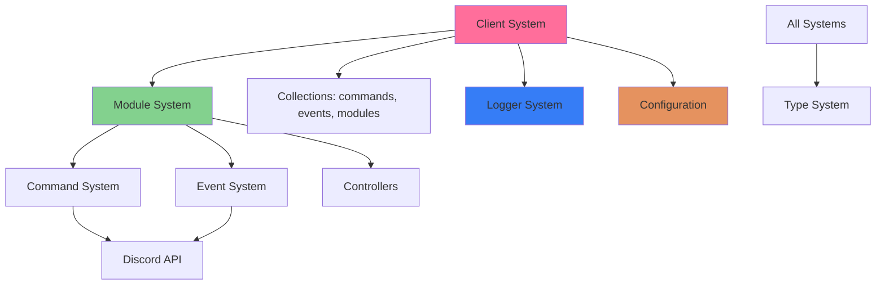

# Core Architecture

This section provides comprehensive technical documentation on Quetza's internal architecture, design patterns, and core systems.

## Overview

Quetza is built on a **modular architecture** that extends Discord.js with plugin-style modules. Each system is designed for extensibility, type safety, and maintainability.

## Contents

### [3.1 Overview](./01-overview.md)
High-level architecture overview with diagrams showing component relationships, data flow, and design patterns used throughout Quetza.

**Topics:**
- Architecture diagrams
- Component relationships
- Data flow patterns
- Design patterns (Module, Registry, Dependency Injection, etc.)
- Key architectural principles

### [3.2 Client System](./02-client-system.md)
The Custom Client class that extends Discord.js and serves as the central hub for the application.

**Topics:**
- Client class structure
- Discord.js integration
- Client initialization process
- Gateway intents
- Client collections (commands, events, modules)
- Client lifecycle
- Application status generation

### [3.3 Module System](./03-module-system.md)
The plugin architecture that enables self-contained feature modules.

**Topics:**
- Module architecture
- Module directory structure
- Module definition (`module.ts`)
- Module loading and registration
- Module dependencies
- Module controllers
- Creating new modules

### [3.4 Command System](./04-command-system.md)
Discord slash command registration, execution, and error handling.

**Topics:**
- Command interface
- Command registration process
- Command execution flow
- Slash command integration (SlashCommandBuilder)
- Command permissions
- Error handling strategies
- Reply system
- Best practices

### [3.5 Event System](./05-event-system.md)
Discord event handling and custom application events.

**Topics:**
- Event interface
- Event registration
- Discord event handling
- Event execution flow
- Multiple event handlers
- Event error handling
- Common Discord events
- Examples

### [3.6 Logger System](./06-logger-system.md)
Centralized logging using Winston for consistent output across all modules.

**Topics:**
- Winston integration
- Logging levels (syslog)
- Log transports (Console, File)
- Log formatting (Simple, JSON)
- Error logging
- Log file management
- Usage examples
- Best practices

### [3.7 Configuration Management](./07-configuration-management.md)
Centralized configuration system for application settings.

**Topics:**
- Configuration structure
- Path configuration
- Application configuration (token, activity)
- Color schemes
- Development settings
- Environment variables
- Module-specific configuration
- Best practices

### [3.8 Type System](./08-type-system.md)
TypeScript type definitions and compile-time safety.

**Topics:**
- TypeScript configuration
- Core type definitions
- Module types
- Command types
- Event types
- Application status types
- Type utilities
- Best practices

## Quick Reference

### Key Files

| File | Purpose |
|------|---------|
| `src/lib/client.ts` | Custom Client class |
| `src/lib/types.ts` | Core type definitions |
| `src/lib/logger.ts` | Winston logger instance |
| `src/lib/misc.ts` | Utility functions |
| `src/index.ts` | Application entry point |
| `config.ts` | Configuration object |

### Core Concepts

- **Module**: Self-contained feature package with commands, events, and optional controller
- **Command**: Discord slash command handler
- **Event**: Discord event listener
- **Controller**: Module-level state manager
- **Collection**: Discord.js Map extension with utility methods

### Architecture Principles

1. **Modularity**: Features isolated in modules
2. **Type Safety**: TypeScript for compile-time guarantees
3. **Extensibility**: Add modules without modifying core
4. **Separation of Concerns**: Clear boundaries between layers
5. **Convention over Configuration**: Standardized structure
6. **Fail-Safe**: Comprehensive error handling

## Architecture Diagram



## Common Patterns

### Accessing Client Collections

```typescript
// Get command
const command = client.commands.get('ping');

// Get module
const musicModule = client.modules.get('music');

// Access controller
const controller = musicModule.controller as Music;
```

### Module Controller Usage

```typescript
async function execute(
    client: Client,
    interaction: CommandInteraction,
    controller?: unknown
): Promise<void> {
    const music = controller as Music;
    const player = music.get(interaction.guild);
}
```

### Logging

```typescript
import logger from "$lib/logger.js";

logger.info("Operation successful", { context });
logger.error("Operation failed", error, { context });
```

### Configuration

```typescript
import config from "$config.js";

const token = config.application.token;
const errorColor = config.colors.error;
const modulesPath = config.path.modules;
```

## Development Workflow

1. **Understand the architecture** (this section)
2. **Set up development environment** (Section 5)
3. **Create a module** with commands and events
4. **Implement controller** for state management
5. **Test** commands and events
6. **Deploy** using Docker or source

## Next Steps

- **For Users**: See [User Guide](../07-user-guide/) for using Quetza
- **For Developers**: See [Development Guide](../05-development-guide/) for creating modules
- **For Specific Modules**: See [Modules Documentation](../04-modules/)
- **For API Details**: See [API Reference](../06-api-reference/)

## Related Sections

- [Getting Started](../01-getting-started/) - Introduction and quick start
- [Installation & Deployment](../02-installation-deployment/) - Setup instructions
- [Modules](../04-modules/) - Detailed module documentation
- [Development Guide](../05-development-guide/) - Building on Quetza
- [API Reference](../06-api-reference/) - Complete API documentation
